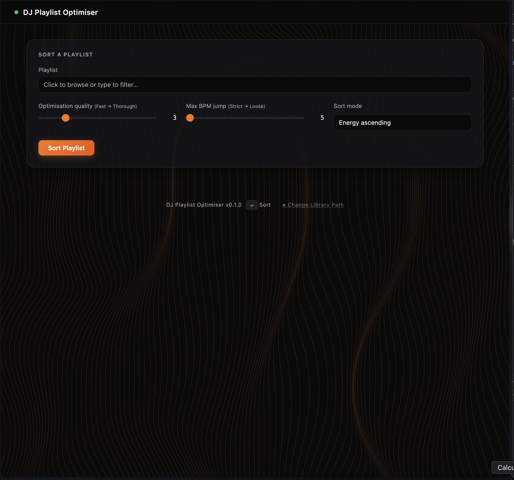

# DJ Playlist Optimiser

[](https://www.python.org/downloads/)
[](LICENSE)
[](https://github.com/astral-sh/ruff)

Reorders djay Pro playlists for smoother DJ sets using Camelot key compatibility,
BPM progression, and energy flow. Runs a greedy sort followed by simulated
annealing to find the best track order, then optionally writes the result back
to djay Pro.

## Features

- **Harmonic mixing** — Camelot wheel compatibility for smooth key transitions
- **BPM progression** — Intelligent tempo ordering for natural energy builds
- **Energy flow** — Automatic energy level classification (low/medium/high)
- **ML personalisation** — Learns from your djay Pro set history to match your style
- **Async processing** — Background sort jobs with progress tracking
- **Multiple export** — M3U files or direct write-back to djay Pro
- **CLI & Web UI** — Command-line tools and a responsive browser interface

## Quick start

```bash
git clone https://github.com/tiandrewthh/DJ-Playlist-Optimiser
cd "DJ Playlist Optimiser"

python3 -m venv venv
source venv/bin/activate
pip install -r requirements.txt

uvicorn api:app --reload
```

Open [http://localhost:8000](http://localhost:8000).

## Demo



## Requirements

- macOS (djay Pro stores its library in `~/Music/djay/`)
- [djay Pro](https://www.algoriddim.com/djay-pro-mac) with at least one playlist
  containing local audio files
- Python 3.9–3.12
- `ffmpeg` for MP3/M4A/AAC analysis (`brew install ffmpeg`)

## Configuration

| Setting | How to set |
|---|---|
| djay Pro library path | Auto-detected. Override via ⚙ in the UI, or set a custom path in the Library Configuration panel. |
| CORS origins | `CORS_ORIGINS=https://example.com uvicorn api:app` (comma-separated; defaults to localhost) |

## How it works

1. **Read** — queries the djay Pro `sqlite` database for playlist tracks and BPM
   data
2. **Analyse** — extracts musical key (Krumhansl-Schmuckler profiles), spectral
   flux, onset density, and onset-based BPM from each audio file via `librosa`;
   results cached in `~/.dj_key_cache.json`
3. **Sort** — builds a pairwise transition cost matrix, greedy nearest-neighbour,
   then refines with simulated annealing
4. **Output** — sorted tracklist with BPM/key annotations; export as M3U or write
   back to djay Pro

If you have djay Pro set history, the app trains a `RandomForestClassifier` on
your actual mixing decisions to replace the heuristic cost with a personalised
ML model.

## CLI usage

```bash
source venv/bin/activate

# Sort a playlist from the command line
python -m djay_sorter sort --playlist "My Mix"

# List all playlists
python -m djay_sorter list

# Train an ML model on your set history
python -m djay_sorter train
```

## Package structure

```
djay_sorter/
├── __init__.py    — backwards-compatible re-exports
├── __main__.py    — python -m djay_sorter entry point
├── constants.py   — paths, Camelot wheel, cost weights, key profiles
├── db.py          — open_djay_db, list_playlists, get_playlist_tracks
├── audio.py       — load/save key cache, extract_audio_features, enrich_with_keys
├── ml.py          — build_training_data, train/load model, ml_cost, ML cost matrix
├── sorting.py     — camelot_distance, transition_cost, total_cost,
│                    greedy_sort, simulated_annealing, assign_energy_levels
├── export.py       — TSAF encoding, export_m3u, create_sorted_clone, DB backup
└── cli.py         — argparse subcommands: sort, list, train
api.py              — FastAPI backend (~20 endpoints)
static/index.html   — vanilla JS SPA (drag-and-drop reordering, stats panels)
tests/
├── test_sorting.py     — 43 tests for core algorithms
├── test_api.py         — 27 tests for FastAPI endpoints
└── test_integration.py — 18 tests for full pipeline integration
```

## API endpoints

Full documentation available at [Swagger UI](http://localhost:8000/docs) when the server is running.

| Method | Path | Description |
|---|---|---|
| `GET` | `/config` | Get library configuration |
| `POST` | `/config` | Set custom db path |
| `GET` | `/health` | Health check, db connectivity, running jobs |
| `GET` | `/playlists` | List all playlists |
| `POST` | `/sort` | Sort playlist (synchronous) |
| `POST` | `/sort/m3u` | Sort and export as M3U download |
| `POST` | `/sort/start` | Start async sort job |
| `GET` | `/jobs/{id}` | Poll job status/progress/result |
| `POST` | `/export` | Write sorted playlist to djay Pro |

## ML model training

Requires ≥200 historical transitions from djay Pro's session history or recorded
sets in `~/Music/djay/Recordings/`. The model is saved to
`~/.dj_transition_model.pkl` and picked up automatically on the next sort.

```bash
python -m djay_sorter train
```

## Troubleshooting

| Issue | Solution |
|---|---|
| `librosa` install fails on macOS | Install `libsndfile` first: `brew install libsndfile` |
| djay Pro database not found | Ensure djay Pro has been launched at least once; the DB lives in `~/Music/djay/` |
| `ffmpeg` not found | Install via Homebrew: `brew install ffmpeg` |
| CORS errors from browser UI | Set `CORS_ORIGINS` env var to match your frontend URL |
| Sort job stuck/failed | Check `/health` endpoint for running jobs; restart server if needed |
| Tracks missing BPM/key | Audio files must be local (not streaming); re-analyse with `extract_audio_features` |

## Development

```bash
# Run tests
python -m pytest tests/ -v

# Lint
ruff check . && ruff format .

# Pre-commit hooks (lint + test)
pre-commit install
```

## Contributing

Contributions are welcome! Please feel free to submit a Pull Request.

1. Fork the repository
2. Create your feature branch (`git checkout -b feature/amazing-feature`)
3. Commit your changes (`git commit -m 'Add amazing feature'`)
4. Push to the branch (`git push origin feature/amazing-feature`)
5. Open a Pull Request

## License

This project is licensed under the MIT License — see the [LICENSE](LICENSE) file for details.
